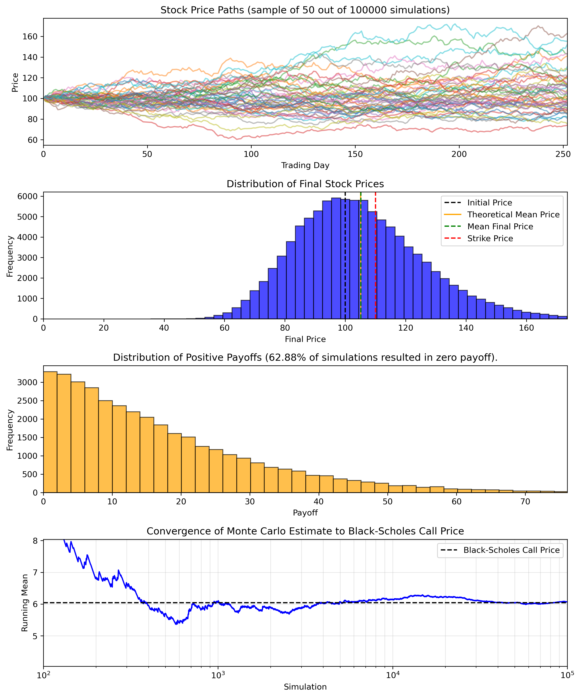

# Monte Carlo Option Pricing
## Overview
This project simulates the price paths of a given number of stocks in a Monte Carlo simulation, accounting for risk-free growth and daily volatlilty. The final price of these is then used to determine the payoff from a European call option for this stock. This Monte Carlo price is then compared to the analytical Black-Scholes call price, with quantified standard errors and a 95% confidence interval.

## Stock price modelling
This project models stock prices through geometric Brownian motion. This accounts for random daily shocks, and their effects on the otherwise constant risk-free rate increase. For each stock path, the payoff is found by substituting the strike price from the final price (down to a minimum value of zero). The payoffs are then discounted back to the present, hence giving the Monte-Carlo option price estimate. The mean of these is then compared with the Black-Scholes analytical price for the input parameters. The project also finds a standard error and a 95% confidence interval for the Monte Carlo estimate, for more effective comparison to the Black-Scholes price.

## Monte Carlo uncertainty
The standard error is calculated by divinding the standard deviation on the discounted payoffs by the square root of the number of simulations. This is then multiplied by 1.96 to produce the approximate 95% confidence interval.

## Example data set
- Initital stock price: £100
- Strike price: £110
- Time to maturity: 1 year
- Risk-free rate: 5%
- Volatility: 20%
- Simulations: 100,000

Outputs: 
- Theoretical mean final stock price: 105.1271
- Mean discounted payoff (Monte Carlo): 6.0703 ± 0.0372
- Black-Scholes call price: 6.0401
- 95% confidence interval for discounted payoff: (5.9974, 6.1432)

## Skills demonstrated
This project developed understanding of previously unknown financial modelling techniques, such as the formula for stock price paths and Black-Scholes analysis. It also developed skill with plotting, statistical distributions, and NumPy arrays.